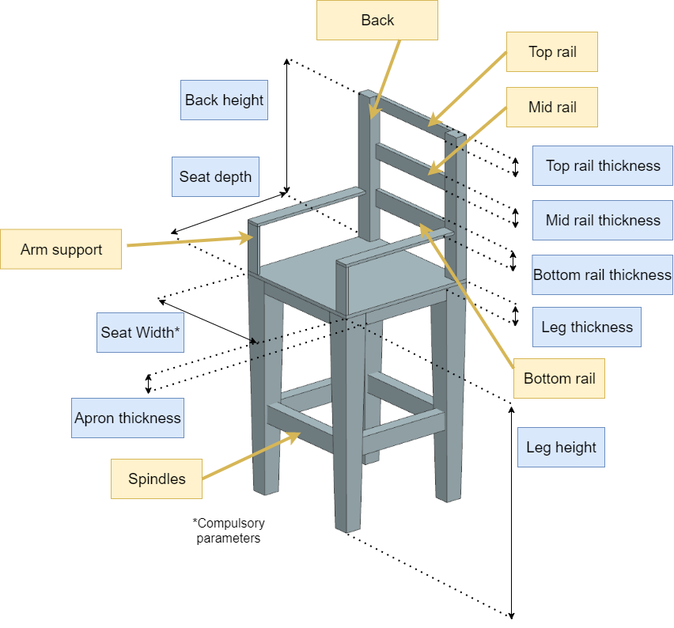
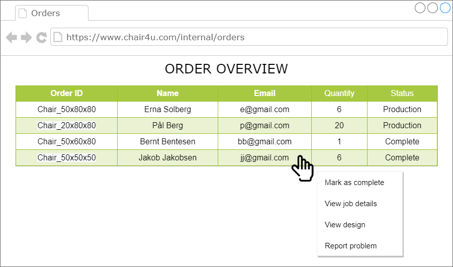
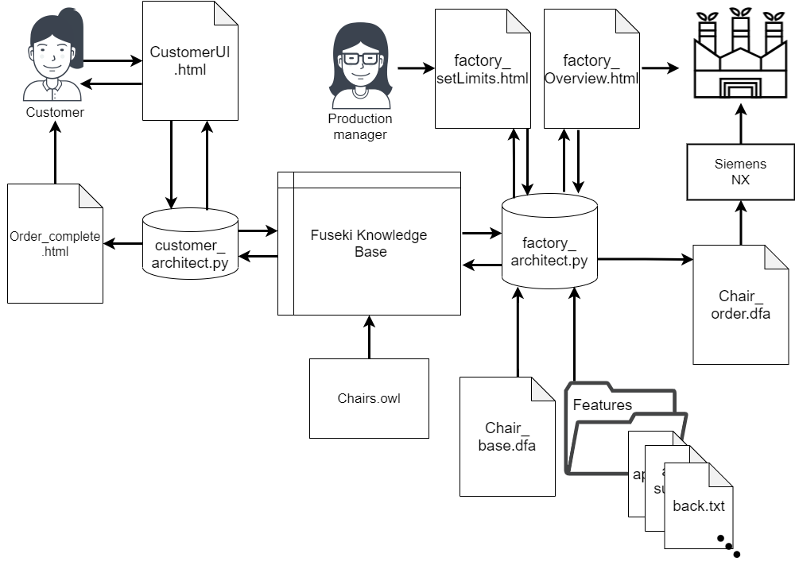
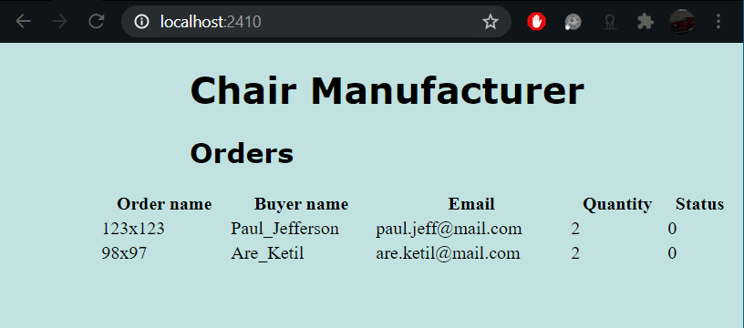
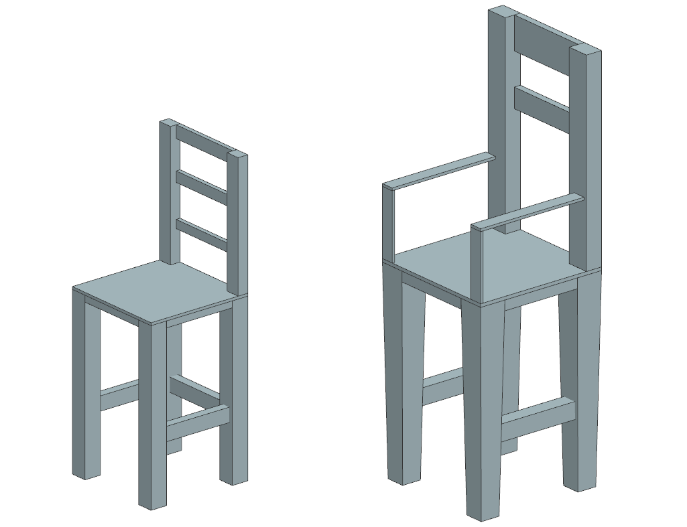

# Group members: Håkon Bakke & Valeria Usenco
# KBE Project Course - Assignment 1 - Chair
# Introduction

This page describes the process of creating a KBE system for customisable chairs utilising a Fuseki database with SPARQL. The system should allow customers to design their own chair through a web-based user interface (UI) and provide the manufacturer with an interface that allows them to set the manufacturing limits. The customer should also receive feedback on their order, for example stating if their order is feasible.  

# Development Overview
## Customer Interface
The customer interface has been designed in draw.io, to serve as a template for the HTML-code. It is important for the customer UI to be user-friendly and easy to use. With this in mind, the parameters for each part of the chair have been split up into sections, so that the user does not get overwhelmed with a long list of parameters. If the user is unsure about what each parameter refers to, they can click the help button which reveals an annotated image of a chair to inform the user about which parameter they can change. Below is a sketch of how the user interface could be designed.


The image that would come up when pressing or hovering over the help button is shown below.



After providing the parameters and pressing the Preview button, a model should be generated and shown in the window on the right. The user can then either choose to add a number of chairs to their order, or generate a new chair by changing the parameters and pressing the Preview button again. The customer can preview and edit it in the menu in the top right corner. When the customer is ready to submit their order, they must provide their contact details, and press submit order. They are then redirected to a page where they get to know if their design is feasible, and the estimated arrival time of their order. 

## Factory Interface
The factory could also have a simple interface showing the order overview. A suggestion is shown in the figure below. The production manager could for example log into the factory web interface and view the orders that have come in from the customers. The suggestion below also shows a menu to be able to edit the order status or view the design.



The factory should also have another interface that allows the production manager to set limits on the parameters for the chair.

## Architecture

A KBE architecture suggestion is shown in the figure below. The customer interacts with the customer UI, where they can design their own chair by writing in dimensions, and selecting what sort of features they would like. Upon pressing preview, an image of their design would come up in the picture box. After submitting an order, the customer gets a "Thank you" message with an estimated time of arrival (ETA) for their order. The ETA is calculated in the customer_architect.py file by checking how many active orders the manufacturer has.



The database ontology is defined by Chairs.owl, which holds definitions for two classes, Order and Chair. Next, the factory_architect.py script serves for several purposes. The architect creates .dfa files from incoming orders by using the Chair_base.dfa file along with the 'features' files containing features that can be selected with the checkboxes. The features are stored as .txt files because they are only used to fill out the base .dfa file. The resulting output is the Chair_order.dfa file which can be viewed in Siemens NX. The factory_architect.py script also displays an order overview, and serves as a user interface for the production manager, who can use it to set the parameter limits.

# Implementation
## Customer User Interface
The image below shows the actual implementation of the customer UI for this task. The image of the chair is static, but represents a live model of the customer's design after pressing "Preview". The customer UI consists of three forms, with a button at the end of each form. The "preview" form is to collect the parameter values, the "quantity" form is to record the number of chairs in the order, and the "submit" form is to record the customer information and send the order.


## Factory User Interface
The factory user interface implemented in this task is shown below. In this case it is a table displaying the orders and their status in addition to the contact information of the customer.




## Factory production manager User Interface
A system for controlling the manufacturability had been implemented. This was done by having a production manager User Interface where the production manager could set maximum and mimimum limits for the chair as seen in the picture below. The submitted limits are sent to the database and read in the customer_architect.py script. The screenshot below shows the stage after the minimum limits have been set and before the maximum limits have been sent.


## UML Sequence diagram
The UML sequence diagram with the customer on the left, and production engineer on the right is shown below. The customer can submit forms which trigger a GET request and save the parameters in the link generated. The production engineer must set minimum and maximum limits through the factoryUI, which are placed on the Fuseki database. On the customer side, pressing the submit order triggers a number of events. The parameters of the chair design are parsed, and a query is sent to the Fuseki database. The return of the query are the maximum and minimum limits for each parameter against which the parameters are checked. If the parameters are within the limits, the database is updated with a chair design, and an order containing the chair design name and quantity. The customer server performs a query to the database to check the total quantity of chairs in the production queue. Finally, the order status is shown in the customer UI. On the production side, a GET request is performed upon refresh, which triggers a query that finds new orders and displays them on the factory overview screen.


## Web-Ontology
The chairs.owl file defines the ontology of the classes Order and Chair. The parameters they contain are shown below.


## customer_architect.py
The customer architect responds to a GET-request triggered by pressing one of the buttons on the customer UI. 

- Pressing the preview button parses the URL and extracts the parameters using string manipulation functions. The parameters are stored in a dictionary called 'values'.

- Pressing the Add to Order button records the value written in the Quantity text box.

- Pressing the Submit button adds the chair design to the database. It also adds an order with the name of the chair design, the quantity, customer name and email. Finally, a "thank you" message is displayed, as well as an estimate of the ETA for the customer's order.

The code to create the update string used to add a chair design to the database uses a for-loop to save time. One of the benefits of using a dictionary to store the parameters is that the keys can be used as parameter names to create the update string. All the boolean variables in the class contain the word "with", so the datatype is set to boolean when that word is found in the key of the values dictionary. 

```python
    chair_name = str(values['s_width']) + "x" +str(values['s_depth'])
    insert_str = '''kbe:chair_''' + chair_name +  ''' a kbe:chair.
                    kbe:chair_''' + chair_name + ''' kbe:name "'''+chair_name+ '''".\n''' 

    for key in values: 
        if key.find("with")!=-1: #all boolean variables contain the word "with"
            datatype = "boolean"
        elif key.find("spindles")!=-1:  #spindles is the only integer in the database
            datatype = "integer"
        else:
            datatype = "float" #the rest of parameters are stored as floats
        insert_str += 'kbe:chair_'+chair_name+ ' kbe:'+ key +' "' + str(values[key])+ '"^^xsd:'+datatype+'. \n'  

    URL = "http://127.0.0.1:3030/kbe/update"
    UPDATE = '''
            PREFIX kbe: <http://www.kbe.com/chairs.owl#>
            PREFIX xsd: <http://www.w3.org/2001/XMLSchema#>
            INSERT
            {
             '''+insert_str+'''             
            }
            WHERE
            { 
            } 
            '''
```

Next, the order update code is similar to the chair database update code, but does not use a for-loop as the function recieves the variables individually.

```python
    orderID = name + chair_name

    URL = "http://127.0.0.1:3030/kbe/update"
    UPDATE = '''
            PREFIX kbe: <http://www.kbe.com/chairs.owl#>
            PREFIX xsd: <http://www.w3.org/2001/XMLSchema#>
            INSERT
            {
             kbe:order_''' +orderID+ ''' a kbe:order. 
             kbe:order_''' +orderID+ ''' kbe:name "'''+name+ '''".
             kbe:order_''' +orderID+ ''' kbe:quantity "'''+str(quantity)+'''"^^xsd:float.
             kbe:order_''' +orderID+ ''' kbe:email "'''+email+'''".
             kbe:order_''' +orderID+ ''' kbe:status "0"^^xsd:float.            
            }
            WHERE
            { 
            }  
    '''
```
The first query function in customer_architect.py is to access the maximum and minimum parameter limits. The function receives a string "MAX" or "MIN", so that it can be re-used to get both the maximum and minimum parameters. The code for the getLimit(max_or_min) function is shown below.

```python
def get_limit(max_or_min):
    #get limits from database
    URL = "http://127.0.0.1:3030/kbe/query"
    QUERY = '''
            PREFIX kbe: <http://www.kbe.com/chairs.owl#>
            SELECT  ?name ?s_width ?s_depth ?a_th ?back_height ?top_th ?mid_th ?bot_th ?leg_height ?leg_th
            WHERE {
            ?a_chair a kbe:chair.
            ?a_chair kbe:name ?name.
            FILTER regex(?name, "'''+max_or_min+'''") 
            ?a_chair kbe:s_width ?s_width.
            ?a_chair kbe:s_depth ?s_depth.
            ?a_chair kbe:a_th ?a_th.
            ?a_chair kbe:back_height ?back_height.
            ?a_chair kbe:top_th ?top_th.
            ?a_chair kbe:mid_th ?mid_th.
            ?a_chair kbe:bot_th ?bot_th.
            ?a_chair kbe:leg_height ?leg_height.
            ?a_chair kbe:leg_th ?leg_th.
            }
    '''
    PARAMS = {'query':QUERY}
    response = requests.post(URL,data=PARAMS)
    json_data = response.json()
    return json_data
```

Another query function is used to provide the customer with an estimate for when their order will arrive, the customer_architect.py script performs a query on the database. The output of this query is the number of chairs in the production queue at the factory. To calculate the number of chairs in the queue, the quantity from one order is only added to the total quantity if the status of the order is "0", representing an unprocessed order. The code is shown below. The quantity parameter is used in another function which estimates the time it takes to produce as many chairs as given in the variable quantity. The formula is arbitrary. To display the estimate, the number of days is written into the order_complete.html.

```python
    URL = "http://127.0.0.1:3030/kbe/query"
    QUERY =    '''
            PREFIX kbe: <http://www.kbe.com/chairs.owl#>
            SELECT ?quantity ?status
            WHERE {
                ?an_order a kbe:order.
                ?an_order kbe:quantity ?quantity.
                ?an_order kbe:status ?status.
                }
            '''
    PARAMS = {'query':QUERY}
    response = requests.post(URL,data=PARAMS)
    json_data = response.json()

    num_of_orders = len(json_data['results']['bindings'])
    quantity = 0
    for i in range(num_of_orders):
        status = json_data['results']['bindings'][i]["status"]["value"]
        if (status == "0"):
            quantity += int(json_data['results']['bindings'][i]["quantity"]["value"])
```

## factory_architect.py
The factory architect allows the production manager to set maximum and minimum limits for parameters, updates the factory overview website (factory user interface) and creates the dfa file with the customer input.

### Setting Parameter Limits - Updating Fuseki Database
The parameter limits can be set by accesing the set_limits page on the server and submitting the forms. The limits are set in the database by performing an update on the database using the function setLimits(max_or_min, values). The parameters of this function are a string specifying whether it is the maximum or minimum being updated, and the values for the limits. The code which is used in the function to create the update string is given below.

```python
def set_limits(max_or_min, values):
    insert_str = '''kbe:chair_''' + max_or_min + ''' a kbe:chair. \n
                    kbe:chair_''' + max_or_min + ''' kbe:name "''' + max_or_min + '''".\n'''
    
    for key in values:
        insert_str += 'kbe:chair_' + max_or_min + ' kbe:' + key +' "' + str(values[key]) + '"^^xsd:float. \n'
    URL = "http://127.0.0.1:3030/kbe/update"
    UPDATE = '''
            PREFIX kbe: <http://www.kbe.com/chairs.owl#>
            PREFIX xsd: <http://www.w3.org/2001/XMLSchema#>
            INSERT
            {
             '''+insert_str+'''             
            }
            WHERE
            { 
            } 
            '''
```
Calling the function as follows would create a chair called "chair_MIN" in the database, which would be accessed by  customer_architect.py to check the parameter limits.

```python
set_limits_("MIN", min_values)
```

### Queries and Accessing Data in Fuseki Database
Accessing the data is automised py using the elements in a dictionary and a for-loop as seen in the code below. The for-loop created the query for accessing the data in the database. The string for the query was then added to the query that is used for accessing the fuseki server. The requested values are stored in a json format by utilising the function response.json(). The function is used both to access the chair designs and the orders. By taking the class name in the form of the string into the function, the class name can be used to form a query.

```python
def make_query(class_name,dictionary):
    where_str = '?a_'+ class_name +' a kbe:'+ class_name + '.\n'
    select_str = ""
    for key in dictionary:
        select_str += ' ?'+key
        where_str += ' ?a_'+class_name+' kbe:'+key+'' ' ?'+key+ '. \n'  

    URL = "http://127.0.0.1:3030/kbe/query"
    QUERY = '''
            PREFIX kbe: <http://www.kbe.com/chairs.owl#>
            SELECT '''+select_str+ '''
            WHERE {
               '''+where_str+'''
            }
            '''
    
    PARAMS = {'query':QUERY}
    response = requests.post(URL,data=PARAMS)
    json_data = response.json()
    return json_data
```

A parser was made to access the differnet parameters more easily. The parser algorithm can be seen below. The parser works for both queries as they take in a dictionary and json_data as parameters and returns a list of dictionaries. For example, the parameters for one chair are stored in the dictionary and if there are more chairs they will be stored in the list and making a list of dictionaries. The same principle applies for orders.


```python
def parse_json(json_data,dictionary): #returns an array with parameters
    chair_list = []
    #get sizes
    num_of_chairs = len(json_data['results']['bindings'])
    for x in range(num_of_chairs):
        for key in dictionary:
            dictionary[key] = json_data['results']['bindings'][x][key]['value']
        dic_copy = dictionary.copy()
        chair_list.append(dic_copy)
    #print("Chair list",chair_list)    
    return chair_list
```

The function that updates the factory overview UI HTML code takes the chair list and order list as parameters and write an order line containing order id, buyer name, customer email, quantity of the order and status for each order by looping through all elements in the chair list. This utilisation shows the benefits of using a dictionary when only some parameters are requested.

```python  
def order_overview(chair_list, order_list):
    msg = ''
    for x in range(len(chair_list)):
        msg +='<tr>'
       # for key in chair_list[x]:
        msg += '<td>'+chair_list[x]['name']+'</td>''<td>'+order_list[x]['name']+'</td>''<td>'+order_list[x]['email']+'</td>''<td>'+order_list[x]['quantity']+'</td>''<td>'+order_list[x]['status']+'</td>'
        msg += '</tr>'
    
    return msg
```

### .dfa file struture 
The dfa template has been split up into a base template, and feature files. The base template contains the minimal features to be able to make a chair: seat width, seat depth, apron thickness, leg height and leg thickness. It also records all the parameters that could potentially be used in a chair design. This file is of .dfa format and is called Chair_base.dfa. The rest of the features are split up into the .txt files and contain dfa code to represent the features which can be toggled using the checkboxes. It is useful to save these as .txt files because the feature files to separate working .dfa files from blocks of dfa files.

The individual files, what features they add, and the customisable parameters of the chair are shown in the figure below.


A dfa file is constructed in the factory_architect.py script in the function makeDFA(chair), which takes in a chair dictionary. A new file is created for each new chair in the list of chairs. The function first iterates through the chair dictionary and replaces the customisable parameters with values, as shown below:

```python
for key in chair:
            dfa_txt = dfa_txt.replace("<"+key+">", chair[key])
```

Then, with an if-statement for each feature that can be toggled, the function selects the appropriate .txt file containing the dfa code for the feature. An example for the arm support feature is shown below. If the chair should have arm support, the feature file for arm support is opened and appended to the model .dfa file. The same procedure is done for each selectable feature represented as a bool in the OWL class diagram further up.

```python
if (chair['with_arm']!="0"):
            feature_file = open("DFA\\Templates\\arm_support.txt", "r")
            feature_txt = feature_file.read()
            order_dfa.write(feature_txt)
```

The chair model .dfa files are saved in the folder named "Orders" with the same name as they are given in the database.

The .dfa code for a complete chair can be seen in Chair_template.dfa. A parametric design approach has been used, with certain parameters which are not directly dependent on the user inputs. These parameters are calculated based on the sizes of other parameters.

# Product examples
Some product examples are shown below. The first example is the most simple design, for example a bench.


Next are two examples of chairs of different sizes. One of the chairs has three spindles and three rails. The other chair only had two spindles and two rails, but has arm support and tapered legs.



# Video 


# Extendability and Improvements
The code developed provides a certain degree of extendability due to multiple factors. Using a consistent naming system for parameters, combined with the use of Python dictionaries gives the opportunity to extend the system by adding more variables and designs. The same functions can be reused with different dictionaries. Another factor is that the system has been split up into many blocks. For example, HTML-files are separate from the Python scripts. This makes makes it easy to modify only the HTML file to change the web-page, rather than the Python file. Another example is the function that gives an ETA on the order. This function can easily be extended to provide a more accurate estimate by taking more parameters into account. The order overview page is independent of what type of product that was ordered. It only takes the order ID and is therefore easily extendable for other types of products/designs.

With only the fundamental structure in place, many things can be improved. Firstly, the web interfaces could be improved with more interactive features. A function to select and change the status of the order should be implemented, to give more feedback to the production engineer. It could also be useful for the prodcution manager to see what the parameter limits already are from before, before changing them. Secondly, more manufacturability checks should be implemented. For example, checking for combinations which do not work - e.g. no back + top rail. The customer should also get more concise feedback on specifically what makes their design not possible to manufacture. 
