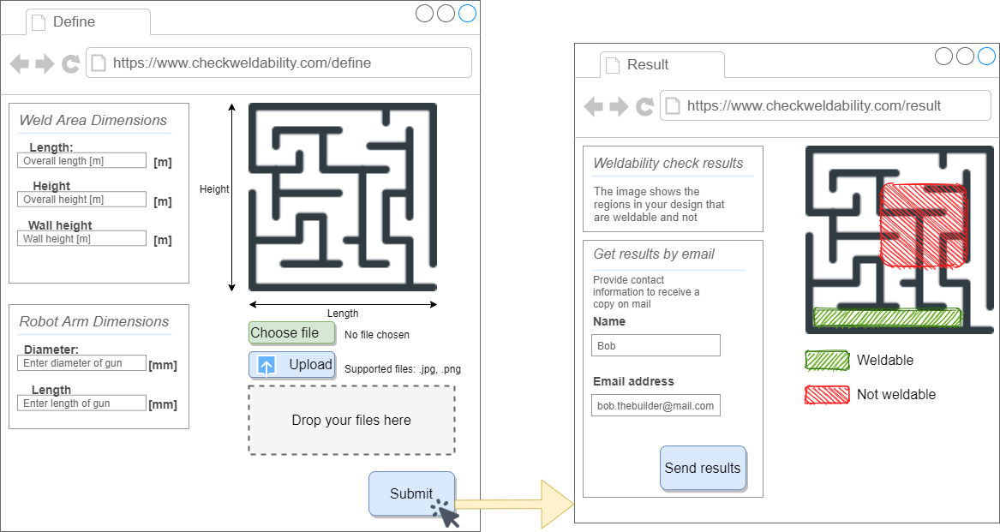

# Group members: Håkon Bakke & Valeria Usenco
# KBE Project Course - Assignment 2 - Weldability check
# Introduction
The task chosen is to design a system to be able to check the weldability of a structure, based on the structure geometry and welding robot dimensions. The system should allow a user to specify the geometry of their design, so that a weldability check can be performed. In this case, the user can upload an image of their design.

# Design Overview
## User Interface
The image below shows an overview of the user interface for the weldability check tool. The customer uploads a 2D image in addition to parameters for overall size and robot space. This gets analysed and after the customer clicks "submit". The user will then be sent to the results page where he has an option to receive the results by email as well as instantly getting them in the browser.

The web-page is divided into sections so as to not overwhelm the user with too many options. The buttons have defined with the principle of "Affordance" in mind. Specifically, they have a shadow underneath, so that they represent a physical button more closely and invite the user to click them. The colours in the web-page are light and simple, so that the web-page is not overwhelming to look at. Another principle that has been used in this interface design is "mapping". The submit button is placed at the bottom right-hand corner, which is a natural placement for a button which triggers a process to go to the next stage. The buttons also change colour when the user hovers over them.

The feedback is given in the form of a picture, using red and green colours. Although these colours carry connotations of whether something is or is not possible, they can also be challenging for users that are colourblind. Therefore, two different shading patterns have been added to the colour regions, so that colourblind users would be able differentiate the regions more easily. Again, the results web-page is divided into sections, to guide the user and not overwhelm them. The button also has the action described on it. 

## Architecture
A suggestion for the architecture is shown in the figure below. The customer interacts with the home page, which is hosted by customer_architect.py. The architect is the main code block which unites the code utilities. Some of the utilities are shown as a stack to the right of the customer architect block. The customer_architect.py script also stores the parameters in a text file,  which is sent to NX_viz.py so that OpenNX can be used to create a model of the welding area, without having to import extra Pyton modules.

## Implementation

