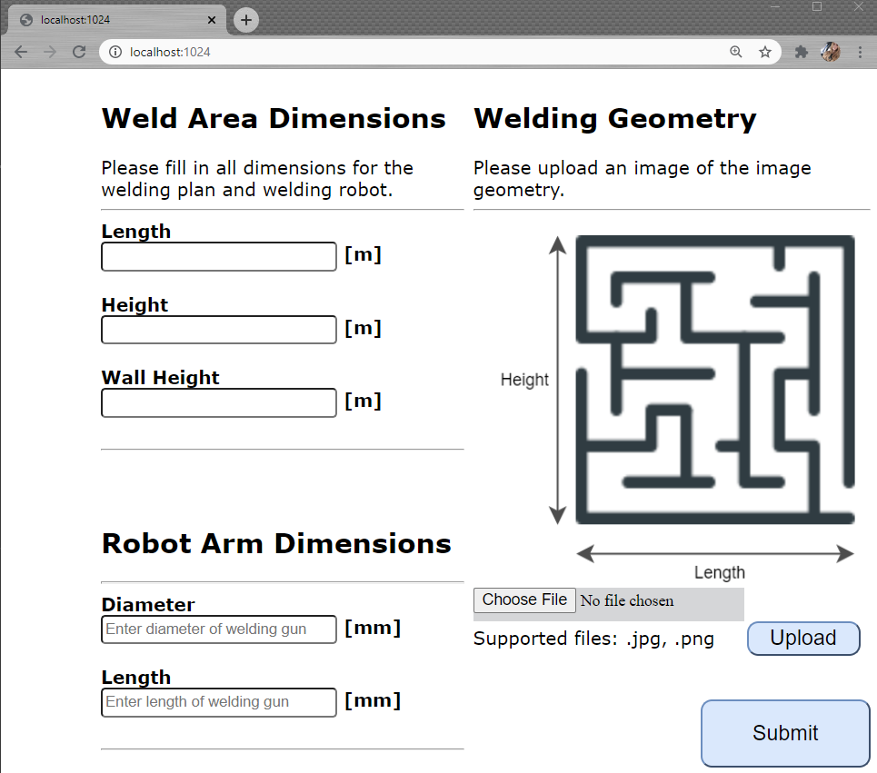
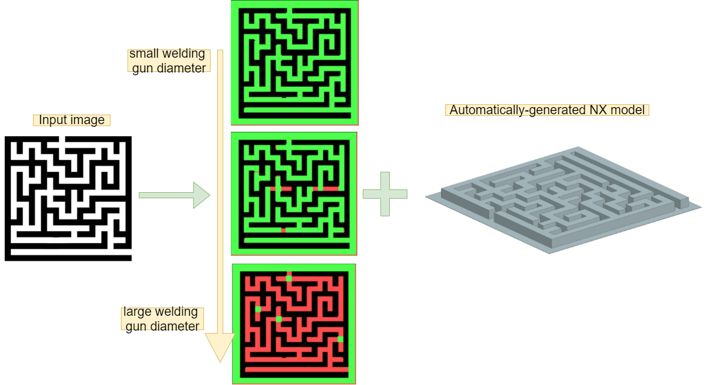
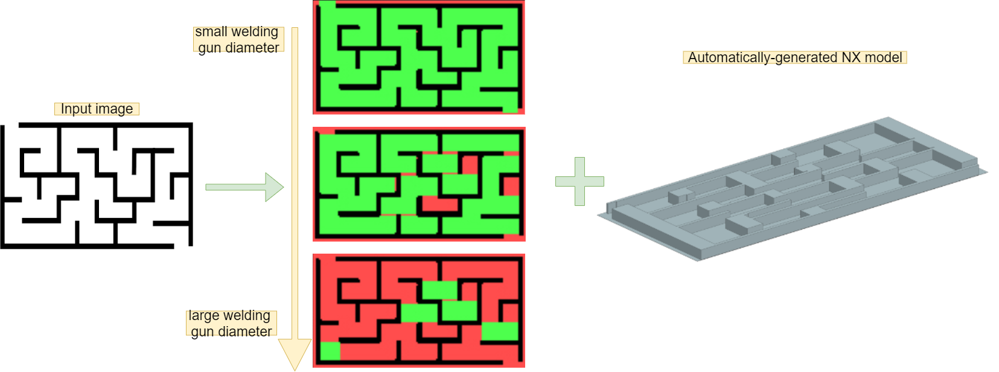

# Group members: Håkon Bakke & Valeria Usenco
# KBE Project Course - Assignment 2 - Weldability check
# Introduction
The task chosen is to design a system to be able to check the weldability of a structure, based on the structure geometry and welding robot dimensions. The system should allow a user to specify the geometry of their design, so that a weldability check can be performed. In this case, the user can upload an image of their design. In this assignment, improvements from the last assignment are highlighted at the end of each section.

# Design Overview
## User Interface
The image below shows an overview of the user interface for the weldability check tool. The customer uploads a 2D image in addition to parameters for overall size and robot space. This gets analysed and after the customer clicks "submit". The user will then be sent to the results page where they have the option to receive the results by email as well as instantly getting them in the browser.

The web-page is divided into sections so as to not overwhelm the user with too many options. The buttons have been defined with the principle of "affordance" in mind. Specifically, they have a shadow underneath, so that they represent a physical button more closely and invite the user to click them. The colours in the web-page are light and simple, so that the web-page is not overwhelming to look at. Another principle that has been used in this interface design is "mapping". The submit button is placed at the bottom right-hand corner, which is a natural placement for a button which triggers a process to go to the next stage. The buttons also change colour and the cursor changes to a hand when the user hovers over them.


The feedback is given in the form of a picture, using red and green colours. An advantage of using these colours is that they are are naturally associated with whether something is or is not possible. However, they can also be challenging for users that are colourblind. Therefore, two different shading patterns have been added to the colour regions, so that colourblind users would be able to differentiate the regions more easily. Again, the results web-page is divided into sections, to guide the user and not overwhelm them. The button also has the action described on it. 

:star: To highlight some improvements compared to the last assignment, the user interface is more interactive with direct visual feedback to the user in the form of changing colours or changing the cursor. The new UI is still plain, but uses some colours to make the buttons stand out more. In addition to this, common icons are used so reassure the user of the meaning of the buttons such as upload and download.

## Architecture
A high-level suggestion for the architecture is shown in the figure below. The customer interacts with the home page, which is hosted by run.py through the use of my_handler.py. run.py is the main code block which unites the code utilities. The weldability check server also interacts with the weldability check module to perform the weldability check. 


A more in-depth description of the architecture is shown in the class diagram below. The process starts with an input image, which is preprocessed before the walls are extracted from it using the wall extraction module. Wall objects store the length and position of each wall found in the picture. They are turned into Block objects and combined to create an NX_model, and used to create an image signifying which areas are weldable or not.  


The UML sequence diagram below shows a run through of a complete system. The user interacts with a web-browser to send welding geometry and dimensions to the weldability check server. In return, the user receives feedback messages after their information has been receieved. After the user presses "Submit" on the home page, the weldability check server uses the corresponding module to check the weldability, make an NX model and feedback image. The NX model and feedback image are sent to the user and displayed on the results page. The user then has the option to download the image and/or request for it to be sent by email.


# Implementation
## UI
The figures below shows the actual design of the web-interface for the task. The upload/download buttons were not implemented. Another feature that was not implemented was the shading patterns on the actual figure in the results.




:star: A big improvement compared to the last assignment is that the UI resembles the initial UI sketch more closely. 

## Modules
The code is divided into several modules which can be found in the utils folder. 
The modules are described here.

### space_for_welding_gun.py
The weldability check is performed here. After confirming that the walls are ok the space is investigated section by section. A zeros array for the space of the robot arm is created and it is scaled down to represent it in pixels. The algorithm loops through the image array in sections of the robot array. If a section of the image array is equal to the robot section then that section is changed to a number representing the colour green. This ends up in a "feedback array". Next the feedback array is fed into an image processing unit to create the feedback image with red and green spots indicating weldability in addition to the walls.
 
### image_process.py
This module contains functions for handling images. One function is used to pre-process an image into a numpy array, another is used to make the feedback image from the array containing which areas are weldable or not.

### my_handler.py
The class to handle HTTP requests is implemented here, along with some helper functions to parse the results and read HTML files. Both do_GET() and do_POST() requests are implemented. The handler also calls the weldability checker and the function which creates the feedback array. It also writes the parameter values into a text file, so that the NX-visualiser can read them.

### Wall.py
The class to store Wall-objects, with helper functions to print and return the parameters in a structured way.

### Block.py
A class used in NXOpen to make Block objects.

### wall_extraction.py
The main use of this module is to find walls in the image array and create a list of Wall objects that are used to create the NX model. The main function in the module is called extract_walls() and works by finding "walls" in the image array. Walls are represented as 1's in the image array. Below is a section of code which checks for horizontal walls. The image array is parsed row by row. When an edge is encountered, the function starts counting the length of the horizontal wall until it sees the end of the wall. Once the end of the wall is reached, it is added to the list of walls and the counter is reset. The same principle is used for finding vertical walls.

```python 
for row in range(img_array.shape[0]):
        for col in  range(img_array.shape[1]):
            
            sec = img_array.astype(int)[row:row+2,col:col+2]
            
            if left_edge(sec):
                #check two steps to the right
                next_sec = img_array.astype(int)[row:row+2, col+1:col+3]
                next_next_sec = img_array.astype(int)[row:row+2, col+2:col+4]

                #if horizontal wall, get coordinates and count length
                if is_wall(next_sec) and not right_edge(next_next_sec): 
                    #record corner coordinates
                    x = col +1
                    y = row
                    while is_wall(next_sec):
                    #start counting length across, until right edge found
                        length +=1
                        col +=1
                        next_sec = img_array.astype(int)[row:row+2, col:col+2]
                    #create wall object and store in list    
                    new_wall = Wall(x*x_scale,y*y_scale,length*x_scale,wall_th*y_scale,wall_height)
                    wall_list.append(new_wall)
                    length = 0

```

The "edge" functions return booleans based on whether an edge or wall is seen. Walls are represented as 1's, whereas empty space is represented as zeros. Therefore the code to find a left-edge is as follows. Functions were made for each type of edge so that the code would be more readable.

```python
def left_edge(sec):
    """ 
        args: 
            sec (np.array[2x2]) - section of the matrix 
        returns: 
            bool - True if left edge encountered
    """

    left_edge = np.array([  [0,1],
                            [0,1]])

    if np.array_equal(sec, left_edge):
        return True
    else:
        return False

```


### NX_viz.py
This is the NX-visualisation module. The model information is read from a text-file. This is to separate NXOpen from other Python modules to avoid errors. Each part of the wall is drawn as a block in the model. Thereafter, all the blocks are united using NXOpen code. The basic building blocks for the code that unites all the blocks was obtained by using the Record function in NX.

:star: In this assignment, the POST request was also used, as opposed to just using the GET request. The POST request is the more correct approach for updating/inserting remote data. In addition, a threaded HTTP server is used, so that a new thread is made for each new request. That is to say that the server should be able to handle multiple requests simultaneously. Another improvement is that the web-page also manages to display pictures correctly, as opposed to the previous assignment, where the alternate text was displayed instead. To achieve this, the correct header must be chosen in the GET-request. This is done in the send_image() function in my_handler.py.

# Examples from run-through
The example below shows the outputs that can be produced from an input image based on what welding gun diameter is submitted. In the first picture, the welding gun can fit everywhere, in the middle it cannot fit where the wall "turns" and in the last picture it cannot fit anywhere. The model generated with NXOpen is also shown.


Below are two more examples with a more complex geometry. 


The algorithm seem to work best at the more simple "mazes". Both in the image above and below, there can be observed regions which should be weldable, but are marked not weldable. This issue is thought to be due to difficulties when scaling and pre-processing the images. A coarse image scaling is being used in the processing in order to get a quick reslut. This can limit the resolution of the image array when representing it as an aray.




# Video

Note: the upload button is pre-programmed to receive the image locally. Please note at the end of the video, that the model takes a little while to load, but is shown at the end.

# Extendability and Improvements
There are a few features that could be improved for an even more extandable solution. The first one is that the walls are counted twice which is unneccesary. A more elegant solution would be to have a system for determining the wall thickness in pixels - e.g. the user can enter wall thickness themselves. 
Another feauture would be to implement more flexible edge functions - i.e. so that the section size could be varied based on wall thickness.

In a real user case, the upload image function coupled with a database would also be working.

Of note, the code developed for finding space for the welding gun is utilising three nested for-loops in python which is not ideal for a fast response and extendable system. This would probably have been swapped out with a function from a library written in a faster programming language when integrating this system in a real user case. 

