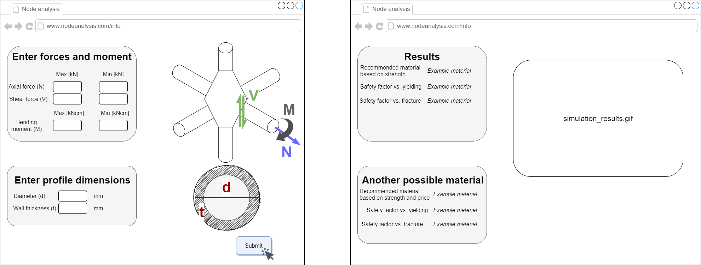

UI.png

# Group members: Håkon Bakke & Valeria Usenco
# KBE Project Course - Assignment 3 - Node validator and recommender
# Introduction
The task chosen is to create a system that can recommend what material to use in scaffolding nodes based on geometric parameters and load as input parameters.

# Design Overview
## User Interface
The image below shows an overview of the user interface for the node calculation tool.

The feedback is given in the form of bullet points in addition to an image of an FEA simulation.

## Architecture

# Extendability and Improvements
Topology optimisation
