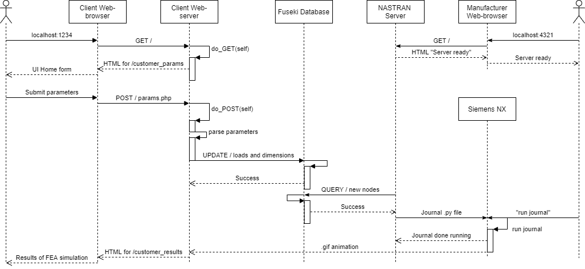
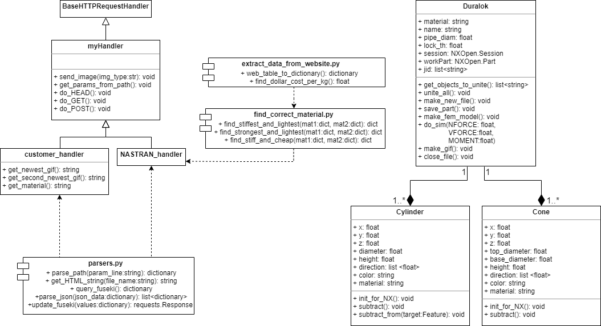
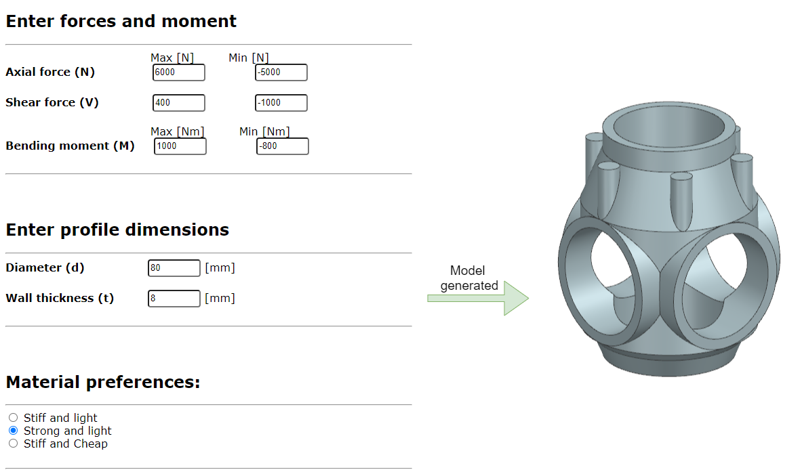
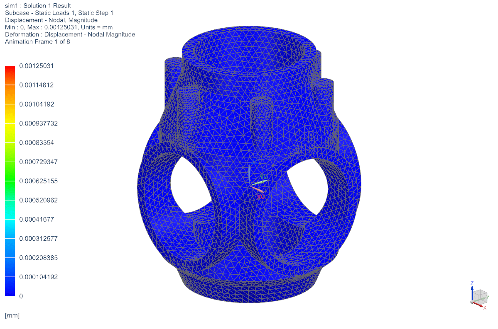
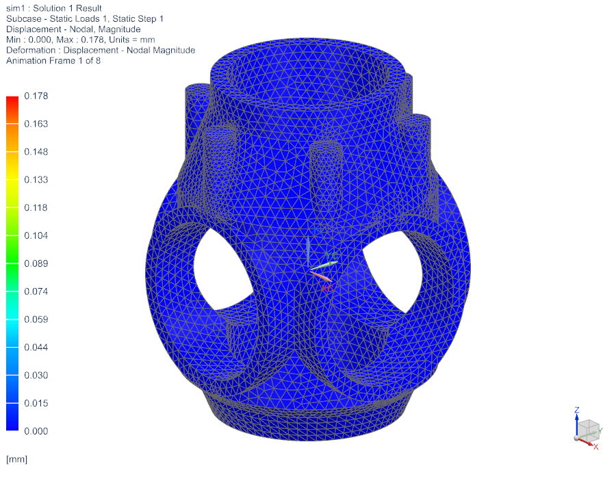
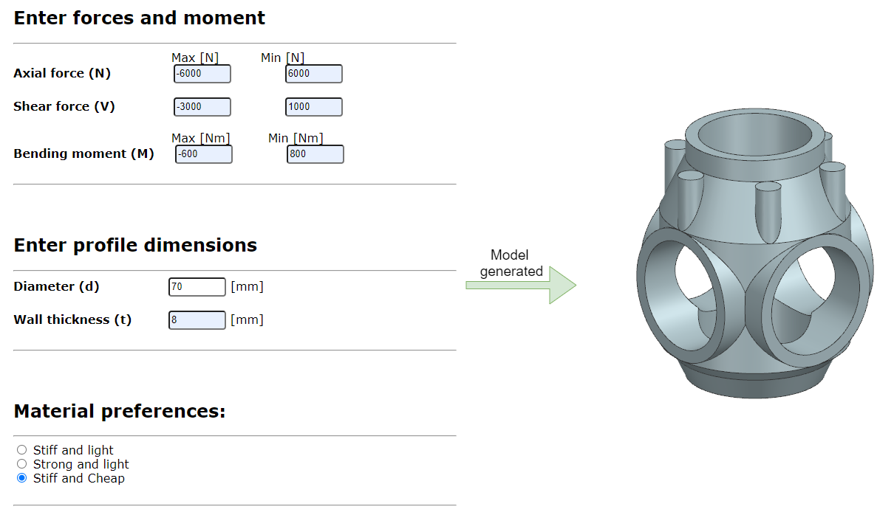
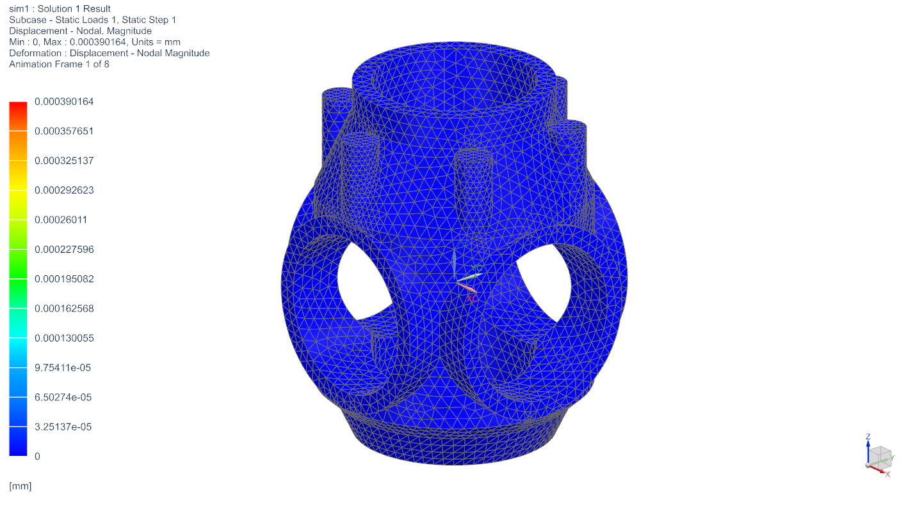
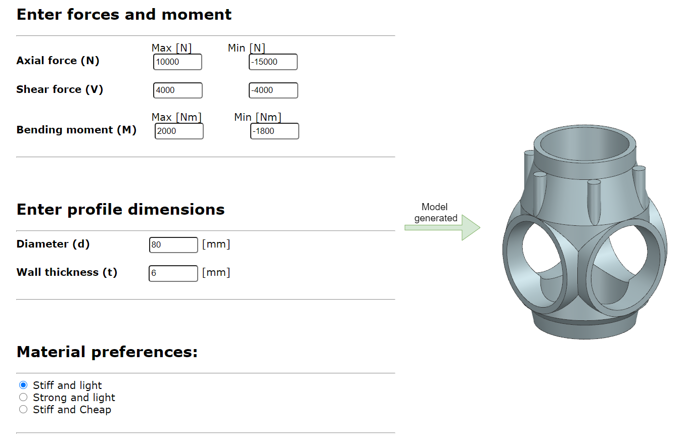

# Group members: Håkon Bakke & Valeria Usenco
# KBE Project Course - Assignment 3 - Node validator and recommender
# Introduction
The task chosen is to create a system that can recommend what material to use in scaffolding nodes based on geometric parameters and load as input parameters. The system performs a finite element analysis (FEA) on the part by applying the forces specified by the user and gives feedback in the form of a gif of the FEA, and material recommendations. 

# Design Overview
## User Interface
The image below shows an overview of the user interface for the node calculation tool where the user can enter parameters and receive feedback.

The feedback is given in the form of bullet points in addition to an image of an FEA simulation.

## Architecture
The architecture is shown in blocks in the figure below, with a short description of what the modules in each block do, and which modules interact with each other. 

Below is a UML sequence diagram which shows the a typical usage scenario for the system from both the customer and manufacturer side. The user can enter loads and dimensions and receives results through a web-browser, while the manufacturer only needs to start the server and play the NX journal.

A more detailed description of the architecture is shown in the class diagram below. The diagram shows that myHandler is a class based on the BaseHTTPRequestHandler, which is a parent class for customer_handler and NASTRAN_handler. These both utilise functions in parsers.py which contains parser-functions and query-functions. NASTRAN_handler also calls the functions to choose the correct material through the use of external modules. The Duralok class is made up of Cylinders and Cones, which are NXOpen Features. The geometry of the duralok joint is defined there, along with the functions needed to perform an automatic FEA.

:star: One improvement from the previous assignments is that the architecture uses class inheritance, which allows two different handlers to be defined based on myHandler. This allows for common functions to be reused without copying code. The functions in the handler have been reused from assignment 2. It is also worth mentioning that the send_image() function from assignment 2 was easy to extend to be able to handle .gifs in addition to .png and .jpg files. Another new feature is that one of the modules, more specifically traidingeconomics.com, retrieves live data and feeds it into the knowledge-based system. 

# Implementation

## Code Modules

* duralok.py - This contains the class for the duralok node. The class has all the functions needed for the node to be built up from cones and cylinders, perform FEA simulations and make a gif.
* myHandler.py - Custom handler with helper functions, derived from BaseHTTPRequestHandler.
* customer_handler.py - Child of myHandler with redefined do_POST() and do_GET() methods to host customer server. Uploads the loads and dimensions defined by the customer to the fuseki database.
* NASTRAN_handler.py - Child of myHandler with redefined do_POST() and do_GET() methods to host NASTRAN server. Queries the fuseki database and finds the most recent addition. Writes the parameters of the most recent addition to params.txt, so that the play_NX scripts can read them.
* parsers.py - helper functions to parse json data and generate query text.
* extract_data_from_website.py - scripts to extract live material information from a website.
* find_correct_material.py - scripts to find the correct material based on specified criteria.
* play_NX_min.py - journal to be played in NX to generate analysis with minimum loads.
* play_NX_max.py - journal to be played in NX to generate analysis with maximum loads.
* run_customer_server.py - script to run the customer server in the terminal.
* run_NASTRAN_server.py - script to run the NASTRAN server in the terminal.

:star: As in assignments 1 and 2, the use of dictionaries makes it easy to add new attributes to the ontology. To add a new attribute, all that needs to be done with the code is the 'values' dictionary in parsers.py needs to be updated with the new attribute as a key. The update/query functions then take care of the rest. However, the .owl file must also be updated. 
An improvement concerning the database is the new naming system for node entries. The name of the node in this assignment is the data and time which the user submitted the order in the following format <YYMMDDHHMMSS>. This allows for NASTRAN_handler to easily sort the entries by time, and perform simulations on the newest entry, contrary to the first assignment, where the NX-generating module checked if a part with the same name existed, before generating it.

# Examples from run-through

## Example 1
### Inputs from user and generated part, the material will be Aluminium:

### Results:

 

## Example 2

### Inputs from user and generated part, this time the material will be Steel:

### Results:

 

## Example 3

### Inputs from user and generated part.

### Results:
The deformation legend shows that the deformation is much larger.

 

# Video
Below is a video of the run-through, sped up 2x.

# Conclusion
A KBE system for proposing node material was sucseffully implemented. The system proposes the best-fit material based on input as load and wishes from the user. The system connects many different modules and information/knowledge is flowing inbetween them.

To conclude, the system was sucseffully implemnted.
# Extendability and Improvements
The systsm now requires the "node calculator" to have an operator with NX running. This is for running the analysis script. In the future this feature would be changed such that python opens NX automatically.

Another feature that can be implemented in the future is topology optimization. The user can then input the design space and loads in the UI and the computer performs a topology optimisation and FEA on the geometry.

It is ieasy to implement new materials, if the designer should be interested in working with other standard metals. Furthermore, the live cost for all the most common metals is already stored in a dictionary
