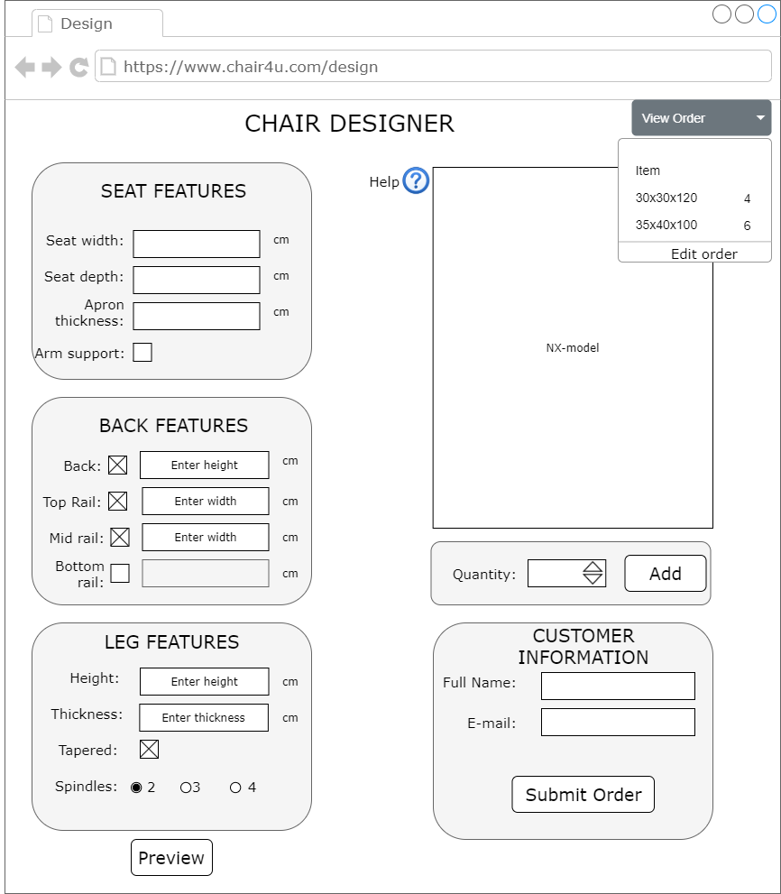

# KBE Project Course - Assignment 1 - Chair
## Introduction

This page describes the process of creating a KBE system for customisable chairs. The system should allow customers to design their own chair through a web-based user interface (UI). 

## Development
### Customer Interface

