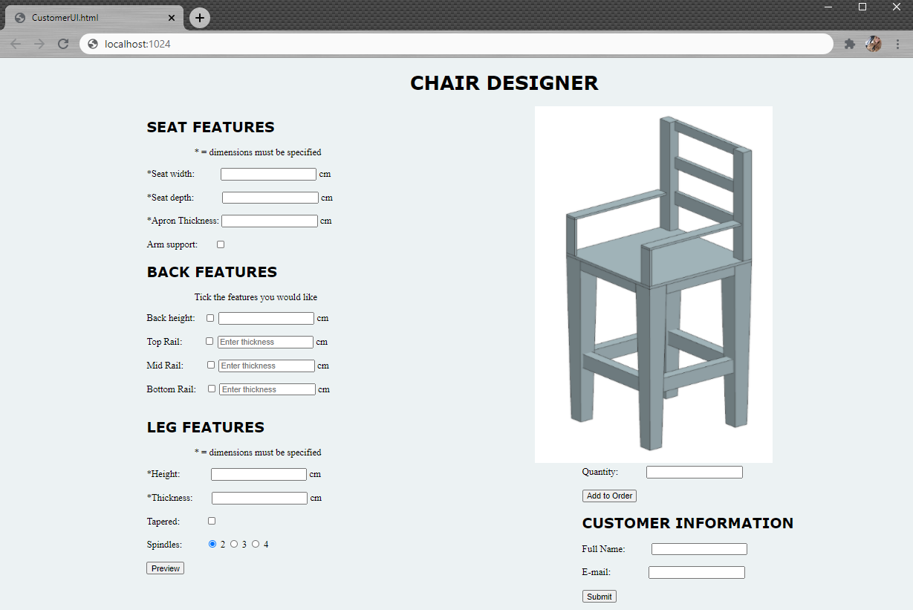
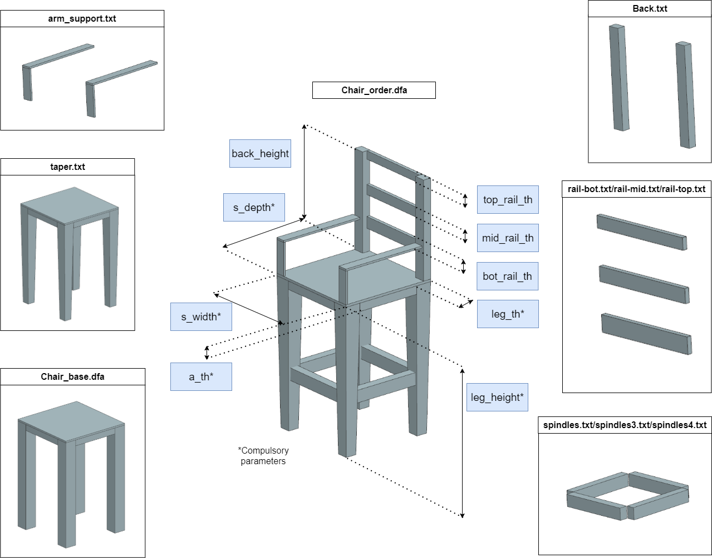

# KBE Project Course - Assignment 1 - Chair
# Introduction

This page describes the process of creating a KBE system for customisable chairs. The system should allow customers to design their own chair through a web-based user interface (UI). 

# Development Overview
## Customer Interface
The customer interface has been designed in draw.io, to serve as a template for the HTML-code. It is important for the customer UI to be user-friendly and easy to use. With this in mind, the parameters for each part of the chair have been split up into sections, so that the user does not get overwhelmed with a long list of parameters. If the user is unsure about what each parameter refers to, they can click the help button which reveals an annotated image of a chair to inform the user about which parameter they can change. Below is a sketch of how the user interface could be designed.


After providing the parameters and pressing the Preview button, a model should be generated and shown in the window on the right. The user can then either choose to add a number of chairs to their order, or generate a new chair by changing the parameters and pressing the Preview button again. The customer can preview and edit it in the menu in the top right corner. When the customer is ready to submit their order, they must provide their contact details, and press submit order. They are then redirected to a page where they get to know the estimated arrival time of their order. The steps of a customer order are shown in the flowchart below.


## Factory Interface
The factory could also have a simple interface showing the order overview. A suggestion is shown in the figure below. The production manager could for example log into the factory web interface and view the orders that have come in from the customers. The suggestion below also shows a menu to be able to edit the order status or view the design.


## Architecture

A KBE architecture suggestion is shown in the figure below. The customer interacts with the customer UI, where they can design their own chair by writing in dimensions, and selecting what sort of features they would like. Upon pressing preview, an image of their design would come up in the picture box. After submitting an order, the customer gets a "Thank you" message with an estimated time of arrival (ETA) for their order. The ETA is calculated in the customer_architect.py file by checking how many active orders the manufacturer has.


The database ontology is defined by Chairs.owl, which holds definitions for two classes, Order and Chair. Next, the factory_architect.py script serves for several purposes. The architect creates .dfa files from incoming orders by using the Chair_base.dfa file along with the 'features' files containing features that can be selected with the checkboxes. The features are stored as .txt files because they are only used to fill out the base .dfa file. The resulting output is the Chair_order.dfa file which can be viewed in Siemens NX. The factory_architect.py script also displays an order overview, and serves as a user interface for the production manager, who can use it to mark orders as complete.

# Implementation
## Customer User Interface
The image below shows the actual implementation of the customer UI for this task. The image of the chair is static, but represents a live model of the customer's design after pressing "Preview". The customer UI consists of three forms, with a button at the end of each form. The "preview" form is to collect the parameter values, the "quantity" form is to record the number of chairs in the order, and the "submit" form is to record the customer information and send the order.



## Factory User Interface
The factory user interface implemented in this task is shown below. In this case it is a table displaying the orders and their status in addition to the contact information of the customer.


## customer_architect.py
The customer architect responds to a GET-request triggered by pressing one of the buttons on the customer UI. 

- Pressing the preview button parses the URL and extracts the parameters using string manipulation functions. The parameters are stored in a dictionary called 'values'.

- Pressing the Add to Order button records the value written in the Quantity text box.

- Pressing the Submit button adds the chair design to the database. It also adds an order with the name of the chair design, the quantity, customer name and email. Finally, a "thank you" message is displayed, as well as an estimate of the ETA for the customer's order.

The code to create the update string used to add a chair design to the database uses a for-loop to save time. One of the benefits of using a dictionary to store the parameters is that the keys can be used as parameter names to create the update string.

```python
    chair_name = str(values['s_width']) + "x" +str(values['s_depth'])
    insert_str = '''kbe:chair_''' + chair_name +  ''' a kbe:chair.
                    kbe:chair_''' + chair_name + ''' kbe:name "'''+chair_name+ '''".\n''' 

    for key in values:
        insert_str += 'kbe:chair_'+chair_name+ ' kbe:'+ key +' "' + str(values[key])+ '"^^xsd:float. \n'  

    URL = "http://127.0.0.1:3030/kbe/update"
    UPDATE = '''
            PREFIX kbe: <http://www.kbe.com/chairs.owl#>
            PREFIX xsd: <http://www.w3.org/2001/XMLSchema#>
            INSERT
            {
             '''+insert_str+'''             
            }
            WHERE
            { 
            } 
            '''
```

Next, the order update code is similar to the chair database update code, but does not use a for-loop as the function recieves the variables individually.

```python
    orderID = name + chair_name

    URL = "http://127.0.0.1:3030/kbe/update"
    UPDATE = '''
            PREFIX kbe: <http://www.kbe.com/chairs.owl#>
            PREFIX xsd: <http://www.w3.org/2001/XMLSchema#>
            INSERT
            {
             kbe:order_''' +orderID+ ''' a kbe:order. 
             kbe:order_''' +orderID+ ''' kbe:name "'''+name+ '''".
             kbe:order_''' +orderID+ ''' kbe:quantity "'''+str(quantity)+'''"^^xsd:float.
             kbe:order_''' +orderID+ ''' kbe:email "'''+email+'''".
             kbe:order_''' +orderID+ ''' kbe:status "0"^^xsd:float.            
            }
            WHERE
            { 
            }  
    '''
```

To provide the customer with an estimate for when their order will arrive, the customer_architect.py script performs a query on the database. The output of this query is the number of chairs in the production queue at the factory. To calculate the number of chairs in the queue, the quantity from one order is only added to the total quantity if the status of the order is "0", representing an unprocessed order. The code is shown below.

```python
URL = "http://127.0.0.1:3030/kbe/query"
    QUERY =    '''
            PREFIX kbe: <http://www.kbe.com/chairs.owl#>
            SELECT ?quantity ?status
            WHERE {
                ?an_order a kbe:order.
                ?an_order kbe:quantity ?quantity.
                ?an_order kbe:status ?status.
                }
            '''
    PARAMS = {'query':QUERY}
    response = requests.post(URL,data=PARAMS)
    json_data = response.json()

    num_of_orders = len(json_data['results']['bindings'])
    quantity = 0
    for i in range(num_of_orders):
        status = json_data['results']['bindings'][i]["status"]["value"]
        if (status == "0"):
            quantity += int(json_data['results']['bindings'][i]["quantity"]["value"])
```

The quantity parameter is used in another function which estimates the time it takes to produce as many chairs as given in the variable quantity. The formula is arbitrary. To display the estimate, the number of days is written into the order_complete.html.

## factory_architect.py
The factory architect updates the factory overview website (factory user interface) and create the dfa file with the customer input.

### Queries and accessing data in Fuseki
Accessing the data was automised py using the elements in a dictionary and a for-loop as seen in the code below. 

```python
def getChairs():
chair_params = { 'name':0, 's_width': 0, 's_depth': 0, 'a_th': 0, 'with_arm': 0, 'with_back': 0,
             'back_height': 0, 'with_top': 0, 'top_th': 0, 'with_mid': 0, 'mid_th': 0,
             'with_bot': 0, 'bot_th': 0 , 'leg_height': 0, 'leg_th': 0, 'with_taper': 0,
             'spindles': 0  }    
    where_str = '''?a_chair a kbe:chair. \n ''' 
    select_str =""
    for key in chair_params:
        select_str += ' ?'+key
        where_str += ' ?a_chair kbe:'+key+'' ' ?'+key+ '. \n'  

    URL = "http://127.0.0.1:3030/kbe/query"
    QUERY = '''
            PREFIX kbe: <http://www.kbe.com/chairs.owl#>
            SELECT '''+select_str+ '''
            WHERE {
               '''+where_str+'''
            }
            '''
   # print("QUERY::", QUERY)
    PARAMS = {'query':QUERY}
    response = requests.post(URL,data=PARAMS)
    #print("Result of query:", response.text)
    json_data = response.json()
    return json_data
```
The for-loop created the query for accessing the data in the database. The string for the query was then added to the query that is used for accessing the fuseki server. The requested values are stored in a json format by utilising the function response.json().

A parser was made to access the differnet parameters more easily. The parser algorithm can be seen below. 


```python
def parseJson(json_data): #returns an array with parameters
    chair_parms = { 'name':0, 's_width': 0, 's_depth': 0, 'a_th': 0, 'with_arm': 0, 'with_back': 0,
             'back_height': 0, 'with_top': 0, 'top_th': 0, 'with_mid': 0, 'mid_th': 0,
             'with_bot': 0, 'bot_th': 0 , 'leg_height': 0, 'leg_th': 0, 'with_taper': 0,
             'spindles': 0 }
    chair_list = []
    #get sizes
    num_of_chairs = len(json_data['results']['bindings'])

    for x in range(num_of_chairs):
        for key in chair_parms:
            chair_parms[key] = json_data['results']['bindings'][x][key]['value']
        dic_copy = chair_parms.copy()
        chair_list.append(dic_copy)
    #print("Chair list",chair_list)    
    return chair_list
```
There were made two parsers and order funtions. One for the chair parameters and one for the order contining customer information. The parser makes a list of dictionaries. The parameters for one chair are stored in the the dictionary and if there are more chairs they will be stored in the list and making a list of dictionaries. The same principle applies for the order parser.

```python
    order_params = { 'name': 0, 'quantity': 0, 
                     'email': 0, 'status': 0  }
    
    where_str = '''?a_order a kbe:order. \n ''' 
    select_str =""
    for key in order_params:
        select_str += ' ?'+key
        where_str += ' ?a_order kbe:'+key+'' ' ?'+key+ '. \n'  

    URL = "http://127.0.0.1:3030/kbe/query"
    QUERY = '''
            PREFIX kbe: <http://www.kbe.com/chairs.owl#>
            SELECT '''+select_str+ '''
            WHERE {
               '''+where_str+'''
            }
            '''
```
The difference between the order and chair accesser is what they are acceessing. The order query is a little shorter due to only four parameters as seen in the dictionary "order_params". 

The parser for the orders is almost identical to the one for chairs. This one collects the ordering data and has fewer parameters to handle. The order json parser can be seen in the code below.
```python

def parseJsonOrder(json_order_data): #returns an array with parameters
    order_params = { 'name': 0, 'quantity': 0, 
                     'email': 0, 'status': 0  }
    order_list = []
    #get sizes
    num_of_chairs = len(json_order_data['results']['bindings'])

    for x in range(num_of_chairs):
        for key in order_params:
            order_params[key] = json_order_data['results']['bindings'][x][key]['value']
        dic_copy = order_params.copy()
        order_list.append(dic_copy)
    print("order list",order_list)    
    return order_list

```
The function that updates the factory overview UI takes the chair list and order list as parameters and write an order line containing order id, buyer name, customer email, quantity of the order and status for each order by looping through all elements in the chair list. This utilisation show the benefits av using a dictionary when only some parameters are requested.

```python  
def OrderOverView(chair_list, order_list):
    Msg = ''
    for x in range(len(chair_list)):
        Msg +='<tr>'
       # for key in chair_list[x]:
        Msg += '<td>'+chair_list[x]['name']+'</td>''<td>'+order_list[x]['name']+'</td>''<td>'+order_list[x]['email']+'</td>''<td>'+order_list[x]['quantity']+'</td>''<td>'+order_list[x]['status']+'</td>'
        Msg += '</tr>'
    
    return Msg
```

### .dfa file struture 
The dfa template has been split up into a base template, and feature files. The base template contains the minimal parameters to be able to make a chair: seat width, seat depth, apron thickness, leg height and leg thickness. This file is of .dfa format and is called Chair_base.dfa. The rest of the features are split up into the .txt files and contain dfa code to represent the features which can be toggled using the checkboxes. It is useful to save these as .txt files because the feature files to separate working .dfa files from blocks of dfa files.

The individual files, what features they add, and the customisable parameters of the chair are shown in the figure below.




A dfa file is constructed in the factory_architect.py script in the function makeDFA(chair), which takes in a chair dictionary. A new file is created for each new chair in the list of chairs. The function first iterates through the chair dictionary and replaces the customisable parameters with values, as shown below:

```python
for key in chair:
            dfa_txt = dfa_txt.replace("<"+key+">", chair[key])
```

Then, with an if-statement for each feature that can be toggled, the function selects the appropriate .txt file containing the dfa code for the feature. An example for the arm support feature is shown below. If the chair should have arm support, the feature file for arm support is opened and appended to the model .dfa file. The same procedure is done for each selectable feature represented as a bool in the OWL class diagram further up.

```python
if (chair['with_arm']!="0"):
            feature_file = open("DFA\\Templates\\arm_support.txt", "r")
            feature_txt = feature_file.read()
            order_dfa.write(feature_txt)
```


